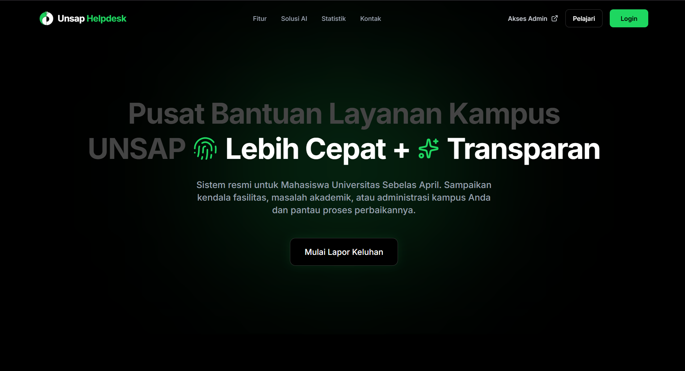
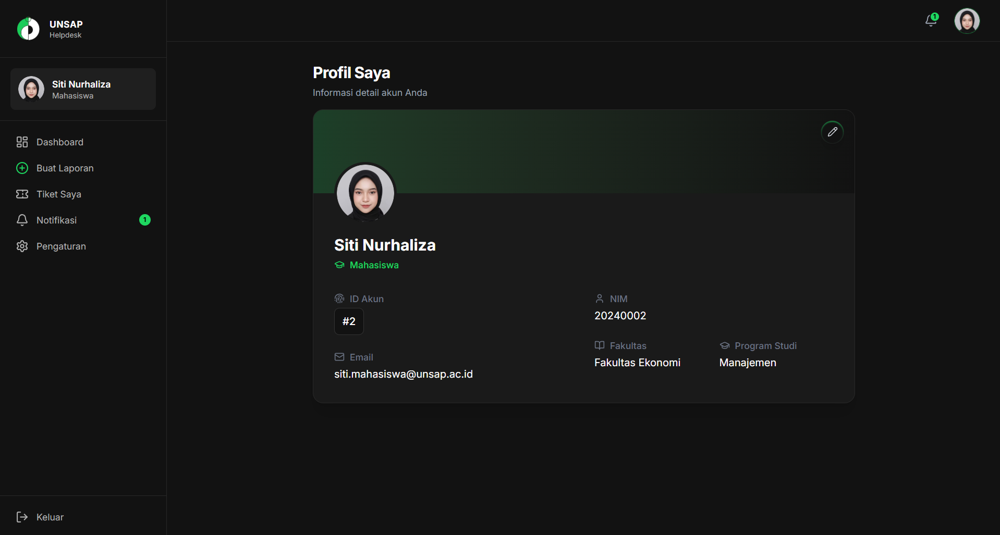
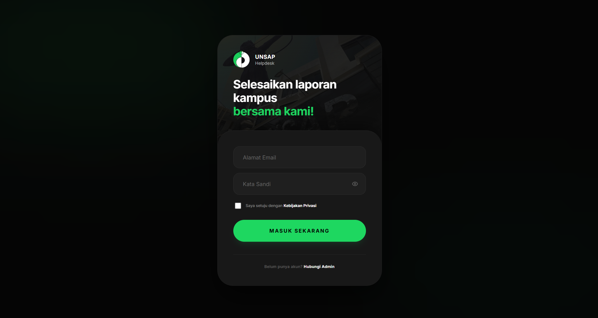
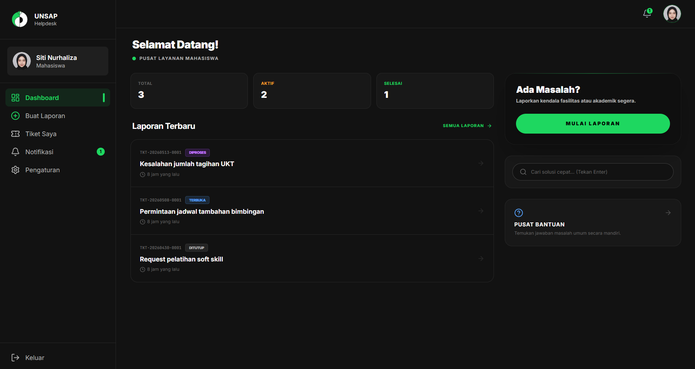
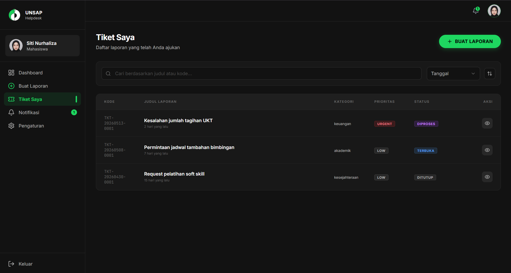

# UNSAP Helpdesk System

A modern, scalable helpdesk platform designed for academic institutions, integrating real-time communication and machine learning to improve issue resolution efficiency and campus service quality.

---

## Preview

<p align="center">
  
</p>

<br>

<p align="center">
  
  
</p>

<br>

<p align="center">
  
  
</p>

---

## Overview

UNSAP Helpdesk System adalah platform full-stack modern yang dirancang khusus untuk lingkungan akademis Universitas Sebelas April (UNSAP). Sistem ini mengintegrasikan komunikasi real-time berbasis WebSockets dan kecerdasan buatan (Machine Learning) untuk meningkatkan efisiensi penyelesaian masalah, memantau Service Level Agreement (SLA), dan mengoptimalkan kualitas layanan kampus.

Proyek ini mengadopsi arsitektur monorepo modular, memisahkan layanan frontend, backend, dan machine learning untuk skalabilitas dan pemeliharaan yang lebih baik.

---

## Visual Aesthetics & Theme (Spotify-Inspired)

Sistem ini mengadopsi tema visual premium Dark Immersive yang terinspirasi dari antarmuka Spotify, dirancang untuk fokus penuh pada konten laporan:
- **Achromatic Dark Theme**: UI menggunakan gradasi warna arang gelap (`#121212`, `#181818`, dan `#1f1f1f`) yang meminimalkan kelelahan mata.
- **Spotify Green Accent**: Warna hijau ikonik (`#1ed760`) digunakan secara presisi untuk kontrol navigasi utama, status aktif, dan tombol aksi (CTA).
- **Pill & Circle Geometry**: Semua elemen interaktif (tombol, input pencarian, lencana) menggunakan bentuk pil bulat penuh (pill-shape) dan kontrol melingkar (circle-shape) untuk kesan taktil dan modern.
- **Premium Typography**: Menggunakan font modern tanpa berkas bawaan browser yang berantakan, didukung oleh efek mikro-animasi halus untuk memberikan pengalaman interaktif yang hidup.

---

## Fitur Utama & Progress Terkini

Sistem ini telah dikembangkan dengan arsitektur penuh (full-stack ecosystem) yang terdiri dari frontend, backend, dan layanan ML. Berikut adalah fitur-fitur yang fungsional dan terimplementasi:

### 1. Smart FAQ Suggestion (FAQ Deflection)
- **Cara Kerja**: Saat mahasiswa mengetik judul atau deskripsi keluhan di form pelaporan, sistem menggunakan teknik debounce untuk memanggil API secara dinamis.
- **Analisis Kemiripan**: API memanggil model **TF-IDF & Cosine Similarity** pada ML Service untuk mendeteksi solusi yang relevan secara instan dari pangkalan data FAQ.
- **Database Fallback**: Jika ML Service sedang offline, sistem Laravel secara otomatis beralih ke metode pencarian database lokal untuk memastikan fitur saran tetap berjalan lancar tanpa interupsi.

### 2. Klasifikasi Urgensi Laporan Otomatis (NLP)
- **Multi-Model Classifier**: Menggunakan model klasifikasi canggih dari Scikit-Learn yang dilatih dengan 4 algoritma pembanding (Naive Bayes, Logistic Regression, SVM, dan Random Forest), lalu secara dinamis memilih model dengan nilai F1-Score tertinggi.
- **Asynchronous Job Processing**: Logika klasifikasi dijalankan secara asinkron di backend Laravel menggunakan Queue Worker (`ProcessTicketML`) agar mahasiswa tidak mengalami kelambatan saat mengirim tiket.
- **Tingkat Urgensi**: Model mengklasifikasikan tiket keluhan ke dalam 3 level urgensi: Low, Normal, dan Urgent.

### 3. Fail-Safe Mechanism & Auto-Escalation
- **Auto-Escalation**: Jika laporan mahasiswa mendeteksi kata kunci darurat sensitif (seperti: "KRS", "UKT", "Pelecehan", "Pencurian", "Kebakaran", "Uang Kuliah", dll.), sistem akan secara otomatis melakukan override prioritas menjadi Urgent demi penanganan segera.
- **Fail-Safe / Graceful Fallback**: Jika ML Service mengalami gangguan (mati atau timeout), sistem Laravel akan menangkap exception dan menetapkan prioritas tiket sebagai Normal. Pengguna sama sekali tidak akan melihat Error 500.

### 4. AI Active Learning (Human-in-the-Loop)
- **Koreksi Master Admin**: Master Admin memiliki otorisasi penuh untuk meninjau prediksi model ML dan melakukan koreksi manual jika terjadi kesalahan klasifikasi.
- **Retraining Dataset**: Data hasil koreksi disimpan otomatis ke tabel `ml_training_data`. Master Admin dapat memicu latihan ulang (retraining) model secara on-the-fly lewat API `/api/retrain` yang otomatis memuat ulang model baru ke memori FastAPI tanpa perlu me-restart server.

### 5. Komunikasi Real-Time & Live Chat Room
- **Laravel Reverb Integration**: Dilengkapi dengan server WebSocket berkinerja tinggi untuk sinkronisasi pesan secara instan.
- **Split-View Resolution**: Antarmuka Admin menyediakan tampilan terpisah (Split View) yang menampilkan detail tiket di sebelah kiri dan Live Chat room dengan pelapor di sebelah kanan.
- **Anonimitas Terjamin**: Jika mahasiswa memilih opsi "Lapor sebagai Anonim", identitas asli (NIM, Nama, Email) disamarkan dengan kode unik (contoh: `Anonim_#8A2C`) bagi Admin biasa, namun tetap dapat diakses oleh Master Admin untuk transparansi hukum.

### 6. Dashboard KPI & Campus Mood Analytics
- **SLA Monitoring**: Memantau kepatuhan waktu penanganan keluhan mahasiswa berdasarkan batas SLA.
- **Caching Data**: Pengambilan data statistik grafik dan tren menggunakan `Cache::remember()` di Laravel untuk kinerja cepat.
- **Campus Sentiment Analytics**: Khusus Master Admin, tersedia panel sentimen kampus bulanan untuk menangkap tingkat kepuasan mahasiswa secara institusional.

---

## Tech Stack & Pilihan Teknologi

### Frontend (Next.js v16)
- Next.js App Router dengan dukungan penuh TypeScript.
- Styling menggunakan Tailwind CSS & UI Components bawaan shadcn/ui.
- State & Form Validation dikelola oleh `react-hook-form` dan `zod` untuk kepastian tipe data.
- Ikonografi interaktif berbasis `lucide-react`.

### Backend (Laravel v12)
- Laravel v12 dengan sistem autentikasi API berbasis Laravel Sanctum.
- Laravel Reverb sebagai mesin pengiriman WebSocket real-time.
- Queue driver dengan antrean asinkron terpisah untuk tugas ML (`ml-processing`).
- Optimasi caching menggunakan memori cache terintegrasi.

### Machine Learning Service (FastAPI / Python)
- FastAPI sebagai web framework berkecepatan tinggi dengan validasi Pydantic.
- Pemrosesan teks tingkat lanjut (Stopwords, Stemming Sastrawi untuk Bahasa Indonesia, dan N-grams).
- Scikit-Learn & Joblib untuk pelatihan, perbandingan, evaluasi, dan penyimpanan model klasifikasi.

### Database & Storage (Supabase PostgreSQL)
- Sistem Database Relasional PostgreSQL dengan Supabase.
- Keamanan data terjamin lewat Row Level Security (RLS).
- Object Storage Supabase untuk pengelolaan unggahan berkas lampiran pendukung laporan.

---

## Struktur Repositori Monorepo

```plaintext
/helpdesk-unsap
│
├── frontend/                   # Halaman Client & Admin (Next.js v16)
│   ├── src/
│   │   ├── app/                # App Router (Dashboard & Halaman Interaktif)
│   │   │   ├── (auth)/         # Portal Login & Register
│   │   │   ├── (dashboard)/    # Portal Mahasiswa & Admin
│   │   │   └── page.tsx        # Landing Page Spotify-Inspired
│   │   ├── components/         # Komponen UI custom & shadcn
│   │   ├── hooks/              # Custom React Hooks
│   │   ├── lib/                # API fetchers, utils, & state management
│   │   └── types/              # Definisi tipe TypeScript
│   ├── public/                 # Aset publik (Gambar, logo, dll)
│   └── package.json            # Dependensi Node.js
│
├── backend/                    # Core REST API (Laravel v12)
│   ├── app/
│   │   ├── Http/Controllers/API/  # Auth, Ticket, Chat, Faq, & Notification Controllers
│   │   ├── Jobs/               # ProcessTicketML.php (Asynchronous ML Job & Fallbacks)
│   │   └── Models/             # Eloquent Models (User, Ticket, Chat, Faq, dll)
│   ├── database/               # Migrasi skema & Seeders lengkap
│   ├── routes/api.php          # Jalur API (Proteksi Sanctum & Rate Limiter)
│   └── composer.json           # Dependensi PHP
│
└── ml-service/                 # Layanan AI (FastAPI / Python)
    ├── datasets/               # Dataset latihan awal (dataset.csv)
    ├── models/                 # Model ML hasil ekspor (.pkl)
    ├── utils/                  # Text Preprocessor & Model Loader helper
    ├── main.py                 # FastAPI Server (Klasifikasi prioritas & Cosine Sim)
    ├── train.py                # Pipeline Training & Active Learning Retraining
    └── requirements.txt        # Dependensi pustaka Python
```

---

## Panduan Instalasi & Setup Lokal

### Prasyarat Sistem
- Node.js (versi >= 18)
- PHP (versi >= 8.2) & Composer
- Python (versi >= 3.10) & pip
- PostgreSQL / Akun Supabase aktif

### 1. Kloning Repositori
```bash
git clone https://github.com/risuunava/smart-campus-helpdesk-unsap.git
cd smart-campus-helpdesk-unsap
```

### 2. Konfigurasi & Jalankan Backend (Laravel)
Pindah ke direktori backend dan unduh dependensi:
```bash
cd backend
composer install
```
Salin variabel lingkungan dan buat kunci aplikasi:
```bash
cp .env.example .env
php artisan key:generate
```
Sesuaikan konfigurasi database Anda di `.env` (isi detail PostgreSQL / Supabase, serta isi `ML_SERVICE_URL=http://localhost:5000`).

Jalankan migrasi tabel beserta data uji (seeder):
```bash
php artisan migrate --seed
```
Jalankan server WebSocket Reverb untuk fitur obrolan real-time:
```bash
php artisan reverb:start
```
Jalankan Queue Worker untuk memproses klasifikasi ML di latar belakang:
```bash
php artisan queue:work --queue=ml-processing
```
Jalankan server lokal Laravel:
```bash
php artisan serve
```

### 3. Konfigurasi & Jalankan ML Service (FastAPI)
Pindah ke direktori ML-Service dan siapkan lingkungan virtual Python:
```bash
cd ../ml-service
python -m venv venv
```
Aktifkan lingkungan virtual:
- Windows: `venv\Scripts\activate`
- macOS/Linux: `source venv/bin/activate`

Pasang dependensi pustaka Python:
```bash
pip install -r requirements.txt
```
Latih model klasifikasi pertama kali menggunakan dataset bawaan:
```bash
python train.py
```
Jalankan server FastAPI ML Service:
```bash
python main.py
```
*(Server ML akan aktif secara default di http://localhost:5000)*

### 4. Jalankan Frontend (Next.js)
Pindah ke direktori frontend dan unduh paket modul:
```bash
cd ../frontend
npm install
```
Buat berkas konfigurasi lingkungan `.env.local` dan isi URL endpoint backend:
```env
NEXT_PUBLIC_API_URL=http://localhost:8000/api
NEXT_PUBLIC_WS_URL=ws://localhost:8080
```
Jalankan server Next.js dalam mode pengembangan:
```bash
npm run dev
```
Buka peramban browser Anda di alamat http://localhost:3000.

---

## Pertimbangan Keamanan & Kehandalan (Security & Reliability)

- **Anti-Spam Rate Limiting**: Mahasiswa dibatasi membuat maksimal 3 keluhan per hari (melalui model `TicketRateLimit` di backend) dan pembatasan frekuensi klik formulir pelaporan (IP Throttle 2 kali per menit).
- **File Upload Guard**: Validasi berkas lampiran yang ketat (hanya ekstensi `.jpg`, `.jpeg`, `.png`, dan `.pdf` dengan batasan kapasitas ukuran berkas maksimal 2MB) untuk mencegah ancaman malware.
- **Supabase RLS & Role Isolation**: Kebijakan Row Level Security Supabase memastikan Admin biasa tidak dapat melacak identitas mahasiswa pelapor anonim, sementara Master Admin memiliki akses menyeluruh untuk keperluan audit internal.

---

## Roadmap Masa Depan

- [ ] Integrasi Notifikasi instan via WhatsApp Gateway dan Email Kampus.
- [ ] Penggunaan model NLP tingkat lanjut berbahasa Indonesia yang lebih kompleks seperti IndoBERT.
- [ ] Pengembangan Aplikasi Mobile (Android/iOS) berbasis React Native untuk aksesibilitas mahasiswa yang lebih fleksibel.
- [ ] Sistem rekomendasi solusi berbasis dokumen akademik (RAG - Retrieval-Augmented Generation).

---

## Lisensi

Proyek ini dilisensikan di bawah MIT License. Lihat berkas `LICENSE` untuk detail syarat dan ketentuan lisensi.

---

## Kontributor

Dikembangkan dengan komitmen penuh untuk modernisasi layanan digital akademis Universitas Sebelas April (Sumedang, Indonesia).
